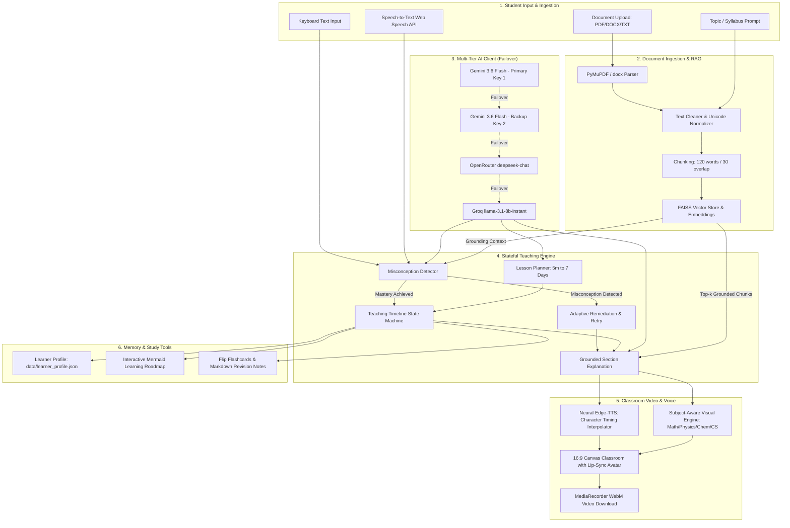

# EduSense AI: Technical Architecture & System Documentation

**EduSense AI** is an advanced, human-like AI educator platform designed for adaptive, multimodal learning. It combines retrieval-augmented generation (RAG), a stateful pedagogical engine, neural text-to-speech with millisecond word boundary synchronization, a 16:9 virtual classroom canvas with live avatar lip-sync, and persistent student cognitive profiling.

---

## 1. Executive Summary & Core Value Proposition

EduSense AI moves beyond static chatbots and pre-recorded video lectures by introducing a **real-time, reactive, and adaptive teaching loop**:
1. **Multimodal Lesson Delivery**: High-definition 16:9 virtual classroom stage with animated teacher avatar, chalkboard concept rendering, dynamic LaTeX math, and live synchronized subtitles.
2. **Pedagogical Adaptive Loop**: Evaluates student responses dynamically, identifies precise conceptual misconceptions, intervenes with tailored remediation, simplifies analogies, and assesses retry answers.
3. **Multi-Source Grounding (RAG)**: Indexes user-uploaded documents (PDF, DOCX, TXT) and syllabus topics into FAISS vector embeddings, grounding all teacher explanations and evaluations in verified study materials.
4. **Resilient Multi-Tier LLM Failover**: Four-tier cascading AI client (`Gemini Key 1` -> `Gemini Key 2` -> `OpenRouter` -> `Groq`) ensuring zero downtime even during rate limit exhaustion.
5. **Persistent Cognitive Profile**: Tracks mastery percentages, recurring misconceptions, weak concepts, and study duration across sessions in `data/learner_profile.json`.

---

## 2. System Architecture & Data Flow



---

## 3. The 12-Step Adaptive Teaching Loop

EduSense AI strictly adheres to the pedagogical progression:

$$\text{Understand} \longrightarrow \text{Plan} \longrightarrow \text{Explain} \longrightarrow \text{Demonstrate} \longrightarrow \text{Question} \longrightarrow \text{Evaluate} \longrightarrow \text{Detect Misconception} \longrightarrow \text{Remediate} \longrightarrow \text{Retry} \longrightarrow \text{Verify} \longrightarrow \text{Report}$$

1. **Understand**: Parses user goals, target duration (5m, 15m, 20m, 30m, 45m, 60m, 7 Days), difficulty level, and selected teacher persona (Dr. Sophia, Prof. Marcus, Alex Rivers).
2. **Plan**: `modules/lesson_planner.py` structures a time-allocated curriculum with milestones, learning objectives, and checkpoints.
3. **Explain**: Generates grounded Hinglish, English, or 11 other multilingual explanations supported by real-world analogies.
4. **Demonstrate**: `modules/subject_visuals.py` generates subject-specific blackboard visuals:
   - *Physics*: Force vector diagrams and free-body representations.
   - *Mathematics*: Dynamic LaTeX equations with step-by-step expansions.
   - *Chemistry*: Reaction equations and molecular formulas.
   - *Computer Science*: Formatted code snippets and algorithmic flowcharts.
5. **Question**: Inserts formative assessment checkpoints after each major subtopic.
6. **Evaluate**: Evaluates open-ended student answers for conceptual fidelity using grounding context.
7. **Detect Misconception**: `modules/assessment.py` isolates false intuitions (e.g., confusing inertia with active force).
8. **Adapt**: Dynamically lowers difficulty or adjusts teaching style, logging the event in `teaching_engine.py`.
9. **Re-explain**: Generates targeted remediation that addresses the specific misconception directly.
10. **Retry**: Formulates a simplified, real-world follow-up question.
11. **Verify**: Confirms mastery once the student demonstrates correct understanding, restoring standard pacing.
12. **Report**: Synthesizes session mastery into a performance report, persists data to `data/learner_profile.json`, and outputs flashcards and revision notes.

---

## 4. Key Module Deep Dive

### 4.1. Multi-Tier AI Client (`modules/ai_client.py`)
- **Resilience**: Implements automated cascade failover:
  ```python
  Gemini Key 1 (gemini-3.6-flash)
        ↓ [on 429 Quota Exceeded / 403 Permission Denied]
  Gemini Key 2 (gemini-3.6-flash)
        ↓ [on Quota/Network Error]
  OpenRouter (deepseek/deepseek-chat or google/gemini-2.5-flash)
        ↓ [on Rate Limit or Invalid Key]
  Groq (llama-3.1-8b-instant)
  ```
- **Guaranteed JSON Extraction**: `generate_json()` sanitizes markdown delimiters (` ```json `), balances brackets, and parses responses cleanly.

### 4.2. Neural Audio Teacher & Word Timing Interpolation (`modules/audio_teacher.py`)
- **Engine**: Microsoft Edge Neural Text-to-Speech (`edge-tts`).
- **Voices**: Multilingual neural voices including `hi-IN-SwaraNeural`, `hi-IN-MadhurNeural`, `en-US-JennyNeural`, etc.
- **Timing Interpolation**: Solves the Edge-TTS Windows limitation where boundary events fire at the sentence level:
  $$\text{Word Duration} = \text{Sentence Duration} \times \frac{\text{Char Length of Word}}{\text{Total Char Length of Sentence}}$$
  Produces accurate `start_ms` and `end_ms` for every word, driving synchronized subtitle highlights and lip-sync mouth movements.

### 4.3. Virtual Classroom Video Stage (`modules/avatar_provider.py`)
- **16:9 HD Stage**: Modern dark-slate classroom with an interactive blackboard and dynamic teacher podium.
- **Teacher Personas**:
  - *Dr. Sophia*: Empathic Socratic mentor in smart blazer with teal accents.
  - *Prof. Marcus*: Rigorous academic in traditional waistcoat with warm amber accents.
  - *Alex Rivers*: Fast-paced practical coach in contemporary indigo attire.
- **Lip-Sync Canvas**: Procedural 60fps canvas renderer matching mouth aperture and shape to audio timings and amplitude.
- **Client-Side Video Export**: Combines the animated canvas video stream with the audio element via `canvas.captureStream(30)` and `MediaRecorder`, enabling instant downloadable `.webm` lecture recordings.

### 4.4. Student Cognitive Profile (`modules/learner_profile.py`)
- **Persistent Storage**: `data/learner_profile.json`.
- **Metrics Tracked**:
  - Total learning sessions & cumulative study minutes.
  - Concept mastery scores ($\%$) and performance trends.
  - Weak concepts catalogue for automated remediation prioritization.
  - History of detected misconceptions across all historical sessions.

### 4.5. Study Tools & Dynamic Roadmaps (`modules/study_tools.py` & `modules/learning_path.py`)
- **Interactive Flashcards**: HTML5 flip-cards with front questions and back key concepts.
- **Revision Notes**: Structured markdown summary with key takeaways and exam tips.
- **AI Roadmaps**: Dynamic Mermaid flowcharts visualizing prerequisites, core topics, and advanced milestones.

---

## 5. Verification & Test Suite

The system includes two comprehensive test suites:

### 5.1. Unit & Integration Suite (`test_modules.py`)
Tests 10 fundamental components:
- Unicode text cleaning and normalization
- Multi-tier LLM generation and JSON parsing
- Neural Edge-TTS synthesis and word timing extraction
- Subject-aware visual generator
- Learner profile loading and persistence
- Learning path roadmap generation
- Study tools (flashcards and revision notes)
- In-lesson Q&A drawer
- Adaptive misconception detection
- FAISS vector indexing and grounded retrieval

**Result**: 10/10 Tests Passed.

### 5.2. Golden Flow End-to-End Simulation (`test_golden_flow.py`)
Simulates the complete classroom journey:
1. Topic ingestion: "Newton's Laws of Motion"
2. Cleaned and chunked in FAISS vector store
3. 20-minute Beginner Lesson Plan in Hinglish
4. Section 1 Grounded Explanation with subject visual
5. Edge-TTS synthesis with word boundaries
6. 16:9 Virtual Classroom HTML generation
7. In-lesson question: "Ek simple daily life example do please"
8. Misconception injection: Student answers that engine pushes passenger forward
9. Evaluator detects misconception: Confusing inertia with external force
10. Teaching engine logs gap, lowers difficulty, and generates remediation
11. Targeted follow-up retry question generated
12. Student provides correct answer: Mastery confirmed
13. Final assessment report generated and saved to `data/learner_profile.json`
14. Flashcards and revision notes produced

**Result**: 100% Success.

---

## 6. Quickstart & Deployment Guide

### Prerequisites
- Python 3.10 to 3.13
- Windows, macOS, or Linux

### Installation
```bash
# 1. Clone repository
git clone https://github.com/shikhabhushaniiitn-ux/EduSense-AI.git
cd EduSense-AI

# 2. Set up virtual environment
python -m venv venv
.\venv\Scripts\activate  # Windows
source venv/bin/activate  # Linux/macOS

# 3. Install dependencies
pip install -r requirements.txt
```

### Environment Configuration (`.env`)
```ini
GEMINI_API_KEY_1=your_gemini_key_1
GEMINI_API_KEY_2=your_gemini_key_2
OPENROUTER_API_KEY=your_openrouter_key
GROQ_API_KEY=your_groq_key
```

### Running the Application
```bash
streamlit run app.py
```
Access the application at `http://localhost:8501`.
